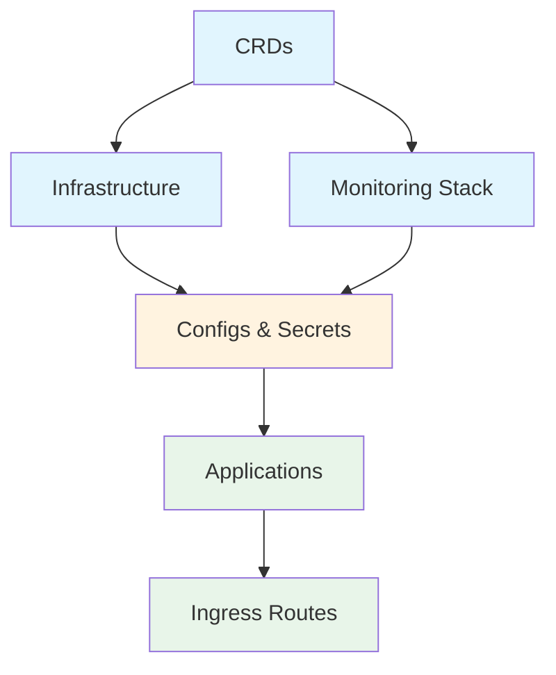

```mermaid
graph TD
    A[CRDs] --> B[Infrastructure]
    A --> C[Monitoring Stack]
    B --> D[Configs & Secrets]
    C --> D
    D --> E[Applications]
    E --> F[Ingress Routes]

    style A fill:#e1f5fe
    style B fill:#e1f5fe
    style C fill:#e1f5fe
    style D fill:#fff3e0
    style E fill:#e8f5e9
    style F fill:#e8f5e9

```
